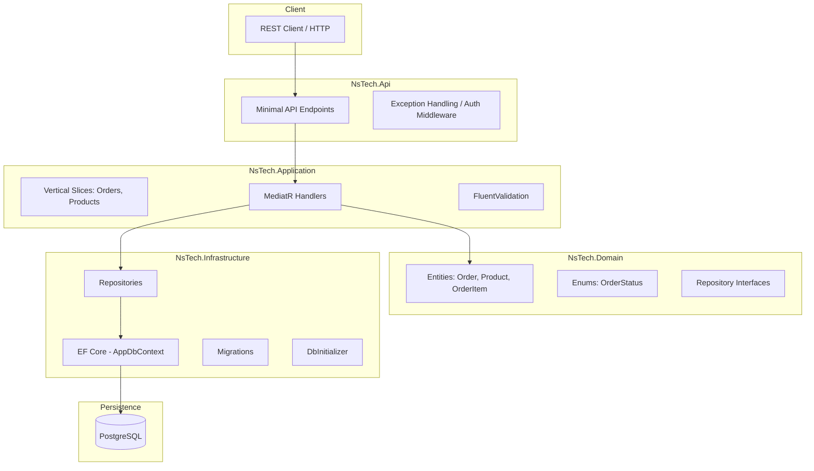

# NsTech Order Service

Este é um serviço de gestão de pedidos com itens e validação de estoque, desenvolvido como parte de um teste técnico para Arquiteto Backend Sênior.

## 🏛️ Arquitetura do Sistema

A solução foi desenvolvida seguindo os princípios da **Clean Architecture** e organizada internamente por **Vertical Slices**. Isso permite uma separação clara de responsabilidades, facilitando a manutenção e garantindo que cada funcionalidade (slice) contenha toda a lógica necessária para sua execução.

### Visão Geral da Arquitetura (Mermaid)



## 🚀 Como Executar

### 🐳 Via Docker (Recomendado)
Certifique-se de ter o Docker instalado e execute:
```bash
docker compose up --build
```
A API estará disponível em `http://localhost:8080`. O Swagger pode ser acessado em `http://localhost:8080/swagger/index.html`.

### 💻 Localmente
1. Tenha um **PostgreSQL** rodando.
2. Configure a connection string em `src/NsTech.Api/appsettings.json`.
3. Instale a ferramenta `dotnet-ef`:
   ```bash
   dotnet new tool-manifest
   dotnet tool install dotnet-ef
   ```
4. Execute as migrações:
   ```bash
   dotnet tool run dotnet-ef database update --project src/NsTech.Infrastructure --startup-project src/NsTech.Api
   ```
5. Rode a aplicação:
   ```bash
   dotnet run --project src/NsTech.Api
   ```

## 🧪 Como Testar

Para rodar a suíte completa de testes (Unitários e Integração):
```bash
dotnet test
```

Para gerar cobertura de testes (requer `coverlet.collector`):
```bash
dotnet test --collect:"XPlat Code Coverage"
```

### 🤖 CI/CD (GitHub Actions)
O projeto possui um pipeline automatizado via **GitHub Actions** configurado em `.github/workflows/dotnet.yml`.
- **Build**: Compilação automática em cada Push ou Pull Request.
- **Tests**: Execução de todos os testes unitários e de integração.
- **Coverage**: Validação de cobertura mínima de **80%**. O pipeline falha se a cobertura for inferior a esse limite.

## 🛠️ Tecnologias e Padrões
- **.NET 10** e C# 14.
- **Minimal APIs** para endpoints performáticos.
- **EF Core** com PostgreSQL e Migrations.
- **MediatR** para desacoplamento e implementação de CQRS.
- **FluentValidation** para validação de inputs (Fail-fast).
- **JWT Authentication** para segurança dos endpoints.
- **xUnit, FluentAssertions, Moq** para testes robustos.
- **Docker & Docker Compose** para orquestração.

## 📝 Decisões Técnicas

### 1. Concorrência e Estoque
Para garantir que não haja estoque negativo sob alta concorrência, implementamos **Optimistic Concurrency Control**.
- A entidade `Product` usa o campo `xmin` do PostgreSQL via EF Core (`IsRowVersion`).
- Na confirmação do pedido, se o produto foi alterado por outra instância, uma `DbUpdateConcurrencyException` é lançada e tratada, garantindo a integridade dos dados.

### 2. Idempotência
Os fluxos de **Confirmação** e **Cancelamento** de pedidos validam o estado atual no domínio.
- Se uma operação é repetida e o pedido já está no estado final esperado, o sistema retorna `204 No Content` sem reaplicar lógica de negócio ou alterar o banco, garantindo o mesmo resultado final (idempotência).

### 3. Vertical Slices e SRP
A aplicação foi organizada em `Features`. Cada pasta (ex: `CreateOrder`) contém seu próprio comando, handler e lógica específica. Isso segue o **Single Responsibility Principle (SRP)** em nível de módulo, evitando "God Classes" e facilitando a navegação.

### 4. Seed de Dados
No ambiente de `Development`, o sistema executa automaticamente um seed de 10 produtos iniciais através da classe `DbInitializer`, garantindo que o ambiente esteja pronto para uso imediato.

## 🔒 Segurança (JWT)
Para acessar endpoints protegidos:
1. Obtenha o token: `POST /auth/token` com `username: admin` e `password: admin`.
2. Adicione o header: `Authorization: Bearer <seu-token>`.

## 📂 Arquivo .http
Na raiz do projeto, encontra-se o arquivo `NsTech.http`. Ele contém chamadas prontas para testar todos os endpoints, incluindo fluxos de sucesso, erro e validações de idempotência.

---
**Candidato:** Arquiteto Backend Sênior
**Projeto:** NsTech Order Service
